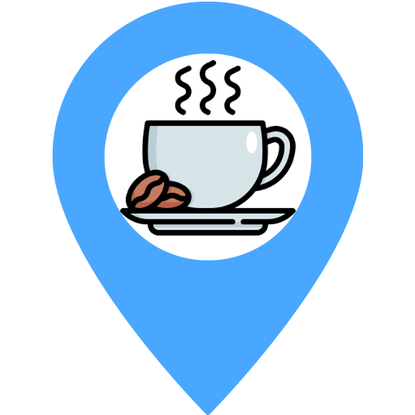
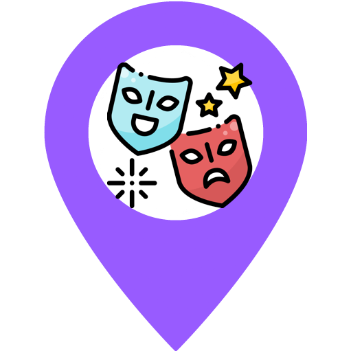
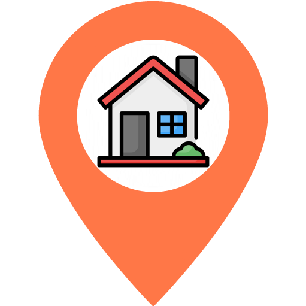
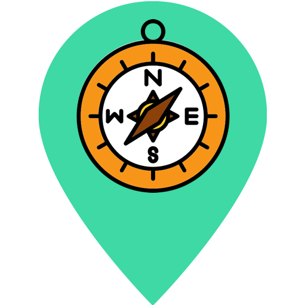
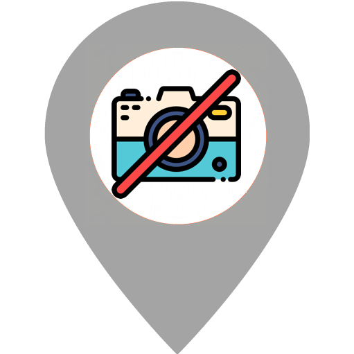
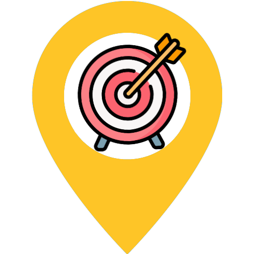

# Take you there

<p align="center">
  <a href="https://takeyouthere.vercel.app">
    
  </a>
</p>
<p align="center">
  <strong><span style="font-size: larger;">Madonna never specified "where", though</span></strong>
</p>

<div align="center">
  
  
  
</div>

<p align="center">
  <a href="https:/github.com/JuditKaramazov">🐱 /JuditKaramazov</a>
</p>
<p align="center">
  <a href="https://karamazfolio.xyz/">📍 Portfolio</a>
</p>
<p align="center">
  <a href="https://karamablog.xyz">☕ Blog</a>
</p>

---

Table of Contents
-----------------

* [🔧 Getting started](#-getting-started)
* [🚪 Introduction](#-introduction)
* [🧬 Structure](#-structure)
  * [📁 Repository](#-repository)
  * [🌐 Website](#-website)
* [🔮 Features](#-features)
  * [🍁 Leaflet](#-leaflet)
  * [📍 Custom pins](#-custom-pins)
  * [🌓 Light & dark themes](#-light--dark-themes)
  * [🐱 GitHub focused](#-github-focused)
  * [🏁 What's next](#-whats-next)
* [💅 Style](#-style)
* [🙌 Immense thanks to them awesome Sponsors](#-immense-thanks-to-them-awesome-sponsors)
* [🏛 License & Copyright](#-license--copyright)

---

## 🔧 Getting started

Surprisingly or not, this little creation is (again!) a [Next.js](https://nextjs.org/) project, flavored with our dearly beloved React and TypeScript wombo-combo. "Old" but gold, am I right? If by any chance you'd want to get started with Next.js and its characteristic neat results, allow me to remind you that achieving such a goal couldn't be easier: all you'll have to do is follow these steps. Carefully. Patiently. _Covered in blood and sweat throughout the entire process._

1. First, clone this repository:
```bash
$ git clone https://github.com/JuditKaramazov/TakeYouThere.git
```

2. Then, install the dependencies:
```bash
$ npm install
```

3. Finally, start the project:
```bash
$ npm run dev
```

You are good to go! However, since this repository is meant to become a "shooting range" for my co-author to get into Git and GitHub's mysteries, you will also find some useful guidelines indicating:

1. How to [run the project on your local machine](CONTRIBUTING.md) for development and testing purposes. It will definitely help you get started!

2. How to create a pull request in order to add a new marker. There's an [issue template available!](https://github.com/JuditKaramazov/TakeYouThere/edit/main/.github/PULL_REQUEST_TEMPLATE/marker.md)

> [!TIP]
> Whatever you decide to do, please remember to respect the [Code of Conduct](CODE_OF_CONDUCT.md) while interacting with the project and the platform itself. Thank you so much for your time and patience!

---

## 🚪 Introduction

Maps have always been an interesting concept to me. Besides the ones we mentally create in our heads (this is, the basic orientation guidelines just so that we won't end up lost in our own city), the idea of a physical item revealing the very soul of the spaces we inhabit (or simply plan to visit) holds a mysterious, evocative power that not many other objects can elicit.

When it comes to video games, for instance (_"you... you are back, Judit! And you are talking about games - again!"_ I couldn't be sick forever, guys), I recently had the pleasure to play two works that, while different in style, shape, genre, and mechanics, incorporated the map as a key element of the overall experience. The first one, [Signalis](https://store.steampowered.com/app/1262350/SIGNALIS/), makes a clever usage of it, as it facilitates a navigation that otherwise, would be impossible for our brains to digest; like a good student of Resident Evil and Silent Hill, the map graphically represents the maze of interconnected rooms, corridors, and spaces we'll have to (re)visit to advance. On the other hand, [Inscryption](https://store.steampowered.com/app/1092790/Inscryption/) traps the player in a cabin in the woods, forcing them to play a card game against a mysterious, shadowed arbiter. In this case, an ever-unfurling map guides both the actions _and_ interactions with our kidnapper, who also happens to be a threatening yet brilliant storyteller. In both cases, the mechanic and evocative connotations of the map are unparalleled: they might seem to represent mere tools, but they are also capable of expanding the limits of human imagination beyond what we'd consider _possible_. 

This applies to the potential of virtuality, of course. What about **physical maps**, though?


<p align="center">
  
    <br/>
    <i>🗺️ Judit, the unmatched traveler. Note the irony.</i>
</p>

Undoubtedly, maps gained new connotations in recent times: without the "dragons" restriction, our societies deeply embraced the possibility of keeping such practical tools in our pockets, even if just in a virtual way. No more space subtracted from our backpacks. No more crumpled sheets. _No more coffee spilled on them._ Although I myself never experienced the real weight of old-fashioned maps, I still found creative ways to fantasize about them - especially while living in Austria, where I started _playing around_ with some pseudo-maps aiming to represent my new position as a pilgrim lost in the middle of nowhere.

As seen above, _I too had my weaknesses_. Once I started traveling around Europe, I decided to graphically represent the places I visited in the most rudimentary way possible. "Not to forget", I suppose. That's another beautiful aspect of maps: they keep both the geographical spaces and the corridors of individual and collective memory intact.

This idea inspired [Take you there](https://takeyouthere.vercel.app): an interactive map empowering users to set different, customized markers in order to immortalize the places they visited together. Was it just a **trip**? Perfect. A special **event**? A _café_ you enjoyed? Pin it and show a `picture` symbolizing the importance behind that moment, then. `Where` is quite a blurry concept, and if [Madonna](https://www.youtube.com/watch?v=79fzeNUqQbQ) didn't specify where that place was, I surely _won't_ make it clear either!

---

## 🧬 Structure

Before exploring the website's structure, it would be interesting to highlight that this is supposed to be `a shared repository`, which justifies the existence of wider guidelines, tips, and indications if we compare this one to some of my old projects. That said, let's first have a look at the `project` and its `specifications`.

### 📁 Repository

As stated in the initial section, I provided some extra guidelines allowing users to navigate the code and implement changes with ease. In case you'd want to know more, make sure to read these indications before getting started:

1. **Setup and development commands** (_starting the development server, testing, linting..._) -> ⚙️ available [here](CONTRIBUTING.md).

2. **Pull request template** -> 📝 available [here](https://github.com/JuditKaramazov/TakeYouThere/edit/main/.github/PULL_REQUEST_TEMPLATE/marker.md).

3. **Fork, clone, add pins, and submit your changes**: _how to_ -> 📚 available [here](/HOWTO.md).

### 🌐 Website

As for the website, despite the simplicity of its main configuration and disposition of elements, it is still effective enough for us to achieve our goal: **creating an interactive map capable of preserving and displaying our shared memories**.

<p align="center">
  
    <br/>
</p>

Essentially, [Take you there](https://takeyouthere.vercel.app) consists on:

1. An `interactive map` with several available themes.

2. A `Menu button` triggering our `Sidebar component`. 

3. A `Sidebar` containing two main sections:

4. `Locations`: This section displays all the pins, detailing the `city`, `country`, `distance/date`, and `author`. It's possible to sort them `by date or distance`.

5. `Contributions`: This section showcases the `amount of pins` added by each contributor. It's possible to sort these contributions `by calculating the added markers and the total distance` after summing all the additions per person.

---

## 🔮 Features

While simple and accessible, `Take you there` offers some interesting features, tweaks, and *s e c r e t s*. Let's have a look at them.

### 🍁 Leaflet

When it comes to the `map` layout, I decided to rely on [Leaflet](https://www.npmjs.com/package/react-leaflet), as it provides bindings between React components and abstract Leaflet layers. Although this package can behave differently from how other React components work (React does not render Leaflet layers to the DOM, for instance; this rendering is done by Leaflet itself), it's still a **smooth**, **accessible**, and **visually appealing** incorporation.

If you want to know how to work with it, you can always check our [Map.tsx file](/components/Map/Map.tsx).

### 📍 Custom pins

Here, you'll find the `nomenclature`, `visual aspect`, and `description` for all our markers:

| Marker             | Description                                                                                                                                  |
| ---------------- | ----------------------------------------------------------------------------------------------------------------------------------------- |
|  `EPinType.Coffee`      | You found an amazing café and you'd want to let everyone know about it.                      |
|  `EPinType.Event`    | Did you go to a concert? Visited a museum recently? Share it!            |
|  `EPinType.Home`      | Places where you've been living - or your one and only home!                      |
|  `EPinType.Picture` | Places you traveled to. |
|  `EPinType.Missing` | After revisiting a pin, you realized that the sticker is now missing... |
|  `EPinType.Goal` | Wishlist time? Let everyone know there are places you'd love to visit! |


### 🌓 Light & dark themes

Speaking of Leaflet, what's great is the possibility of **incorporating different themes**, such as `Earth`, `Light`, and `Dark`:

```typescript
export const DEFAULT_TILES: ITyle[] = [
  {
    id: ETheme.Earth,
    name: 'Earth',
    url: 'https://{s}.tile.openstreetmap.org/{z}/{x}/{y}.png'
  },
  {
    id: ETheme.Light,
    name: 'Light',
    url: 'https://tiles.stadiamaps.com/tiles/alidade_smooth/{z}/{x}/{y}{r}.png'
  },
  {
    id: ETheme.Dark,
    name: 'Dark',
    url: 'https://tiles.stadiamaps.com/tiles/alidade_smooth_dark/{z}/{x}/{y}{r}.png'
  }
]
```

At the same time, even though I didn't have in mind a dark theme for the app at first, I ended up making it possible to `change the theme of the Sidebar` depending on the theme you choose for the map. This way:

1. `Earth` and `Light` themes will display a general light mode.

2. `Dark`, on the other hand, will apply to the rest of the application as well - not only to the map! Gotta take care of our eyes here.

<p align="center">
  
    <br/>
</p>

### 🐱 GitHub focused

Now, the question: _"How does it work, Judit?"_ In this case, and since I wanted to show my co-author, `@AuNedelec`, the terrible side of `development environments`, `Git`, `GitHub`, and the never-ending amalgam of code we must face day after day, `all the additions and changes are controlled through the interaction with this repository`. 

As I previously expressed in the [pull request guidelines](https://github.com/JuditKaramazov/TakeYouThere/edit/main/.github/PULL_REQUEST_TEMPLATE/marker.md), there are two essential steps for people to contribute:

1. First, you'll have to add the image that will appear alongside the marker. The picture will be stored under `public/photos`, in a folder named after your GitHub username. As an example: `public/photos/JuditKaramazov`.

2. Then, move to the `data` directory, open the `places.ts` file, and add a new object to the array:

```typescript
{
  author: 'Judit Lázaro',
  username: 'JuditKaramazov',
  type: EPinType.Coffee,
  title: 'Cafe Sissi',
  city: 'Engelhartszell an der Donau',
  country: 'Austria',
  coordinates: [48.500309, 13.7327201],
  date: '2021-02-09',
  photo: '/photos/JuditKaramazov/cafe-sissi-engel.jpg'
}
```

The easier, the better! 🚀

### 🏁 What's next?

Initially, I created this little application as a "shared yet personal album" containing all the places we visited together. Given the fact that my partner in crime showed some interest in programming, I thought it would be nice to make the transition slightly smoother by `sharing a common project`, preventing the first interactions with our digital universe from being so imposing.

<p align="center">
  
    <br/>
</p>

Independently of that, I also considered the idea of making this little site `available to anyone interested in sharing a similar "space" with their loved ones`. Honestly speaking, although it's not the case yet, if there's someone interested in expanding the possibilities of this application, I'll gladly work on an **extension** of `Take you there` including:

>     - [ ] Register and login options. 
>     - [ ] Persistent choices.
>     - [ ] Shared hubs, also known as a `unique space` for you and your friends to share your unique memories without interfering with someone else's data.
>     - [ ] Accessible ways of interacting with the app: for example, `typing the name of the place directly` and making it easier to `add your pictures` without having to recur to our coding madness.

Please bear in mind that I plan to keep this repository up to date by actively creating new issues and working on any technological improvements and changes that may affect its proper functioning. Also, remember that this list is not exhaustive, and I'll continue adding more `checkboxes` to it as I identify new opportunities for improvement. I do value your feedback, and I'm highly responsive to suggestions and ideas that may enhance our experience on this platform, so do not hesitate to share your thoughts with me!

---

### 💅 Style

_Ah, the styles._ What a concept.

Previously, I shared the rudimentary map that inspired this repository, which happened to be a dramatically-flat image with several countries crossed depending on my trips. Based on such a simple concept, I tried to find a way to make this application as clean and intuitive as possible, always taking into account that our experience as users dictates the success or failure of every single website and application.

<p align="center">
  <a href="https://takeyouthere.vercel.app">
    
  </a>
</p>

Considering this, the styles that I chose tried to represent this idea of accessibility in the most accurate way: a basic menu, a soothing color palette, and some easily distinguishable markers making navigation smooth and instinctive. As for the `markers`, I found most of the images contained inside on the interwebz; [Freepik](https://www.freepik.com/), as usual, proved to be a loyal companion. Thanks for the great assets!

On the other hand, both the `marker` used as a favicon and the `original logo` exist thanks to the talented [@AuNedelec](https://github.com/AuNedelec), who's always been willing to give me a hand with the branding of my applications and websites. `Thank you` for your patience, artistic aptitudes, and above all, company. Since `Take you there` aims to become a nice hub for our shared memories to exist, I genuinely hope you'll find it as beautiful as I perceive find everything you create.

Nos quedan muchos, muchísimos sitios por ver. Ojalá podamos recogerlos todos en este pequeño santuario.

---

## 🤝 Contributions

Please feel free to contribute to the quality of this content by submitting PRs for improvements or possible collaborations, just as it was explained in the [Contributing document](CONTRIBUTING.md). Remember that whatever feedback you can provide me with is much appreciated. Also, keep in mind that I am indeed **open to suggestions** regarding possible extensions of `Take you there`, so do not hesitate to let me know if that would be your wish!

---

## 🙌 Immense thanks to them awesome Sponsors

I can't close this chapter without intoning a loud and sincere: `Thank you! 🥳`. 

To our amazing Sponsor, `@Entreprises LEMRHALI`, `thank you so much` for your constant **support** and **presence**. Without the vision and understanding of our sponsors, we'd end up completely lost in the dark corners of this immense, virtual spiderweb, unable to admire the light that we, as creators, hold deep within. Luckily for me, you've been here during these dark moments of mine, encouraging me to "keep on keeping on". It's not easy - it wasn't before, and it still isn't. However, knowing that I am "not entirely alone just yet" is the best gift I could have ever asked for.

Gracias de nuevo - de corazón. Ojalá seas capaz de recordarte a ti mismo que la luz y la bondad que ves en otros existe también en ti. ¡Hay esperanza!

<p align="center">
  
</p>

---

## 🏛 License & Copyright

This work lives under the robust roof of the [MIT License](LICENSE.txt); whatever visual or written content scapes from it, you'll always find a proper reference specifying the authors and websites behind it.

Attributions are essential these days, and whoever took part directly _or_ indirectly in this project deserves the best possible recognition! That said, and only if you enjoyed what you found here, remember that you can make the Dinosaur extremely happy if you...
<br />

---

<h1 align="center">
  <a href="https://karamazfolio.xyz/">
</h1>
<h2 align="center">
  <a href="https://www.buymeacoffee.com/JuditKaramazov" target="_blank"></a>
</h2>
